# Distributed Modular Monolith Point-of-Sale (POS) System

This repository hosts a state-of-the-art **Distributed Modular Monolith** implementation of a high-performance **Point-of-Sale (POS)** platform. The system is designed around **strict modular boundary separation** across business domains (Authentication, User, Merchant, Product, Cashier, Category, Transaction, Order, etc.) while maintaining the simplicity of running and deploying as a single unified service.

Unlike traditional monoliths, this architecture exposes a **unified GraphQL API Gateway** to external clients and leverages high-performance, strongly-typed **gRPC** for low-latency internal communication between modules. This allows the codebase to scale seamlessly and enables any individual module to be extracted into its own independent microservice if required by business growth.

---

## Key Features

*   **Authentication & Granular Access Control**
    *   JWT-based session authentication with secure token management.
    *   Role-Based Access Control (RBAC) supporting **Admin**, **Merchant**, and **Cashier** roles.
    *   Fine-grained permissions evaluated dynamically at the GraphQL Gateway and gRPC handler levels.

*   **Merchant & Cashier Operations**
    *   Merchant onboarding, registration workflows, and branch configuration.
    *   Multi-cashier sub-account management nested under specific merchant stores.
    *   Event-driven merchant ledger reconciliation integrated with the Transaction Service.

*   **Inventory & Catalog Management**
    *   Fully-featured CRUD operations for products and dynamic categories.
    *   Real-time stock tracking, inventory alerts, and historical pricing updates.
    *   Role-based read/write access constraints ensuring store catalogs remain tamper-proof.

*   **High-Frequency POS Transactions**
    *   Rapid basket creation, real-time checkout flows, and instant inventory deductions.
    *   Atomic status updates (Pending, Paid, Refunded, Canceled).
    *   Low-latency caching with Redis to accelerate checkout validation and basket lookups.

*   **Event-Driven Asynchronous Pipelines**
    *   High-throughput Apache Kafka event streaming to decoupled downstream tasks.
    *   Automatic processing of out-of-band events (e.g., wallet updates, ledger settlements, email notifications).

*   **Enterprise Observability & Telemetry**
    *   Structured, contextual logging (Promtail → Loki).
    *   Comprehensive performance metrics exposed via `/metrics` (Prometheus).
    *   End-to-end distributed tracing across all HTTP/GraphQL and gRPC borders (OpenTelemetry → Jaeger).
    *   Stunning, pre-configured Grafana dashboards for real-time visualization of system health.

---

## Architecture & Deployment Model

### **1. Docker Compose (Local Development)**
*   Orchestrates the entire stack locally: **API Gateway, Downstream Services, PostgreSQL, Redis, Apache Kafka, Zookeeper, and the Observability Pipeline**.
    *   Ensures engineers can spin up a fully isolated, production-like replica of the architecture with a single command.
    *   Leverages Docker networks to secure internal gRPC traffic while only exposing NGINX (port `80`) and the GraphQL Playground to the host.

### **2. Kubernetes (Production Scale)**
*   Deploys each domain service into its own dedicated set of **Pods** to maintain hard resource boundaries.
*   Configures **Horizontal Pod Autoscalers (HPA)** to dynamically scale high-load services (e.g., *Order*, *Transaction*, or *Product*) in response to traffic spikes.
*   Separates stateful data layers (PostgreSQL, Redis, Kafka) using Kubernetes Persistent Volumes (PV/PVC) and StatefulSets.
*   Integrates Prometheus Operators and Promtail DaemonSets to harvest node-level metrics and container logs transparently.

---

## Technology Stack

| Technology | Role | Details |
| :--- | :--- | :--- |
| **Go (Golang)** | Core Language | Built using a multi-module Go workspace (Go 1.25+) |
| **GraphQL** | Presentation Layer | Unified entry point powered by **99designs/gqlgen** |
| **gRPC & Protobuf** | Internal Transport | High-performance, strongly-typed internal RPC contract |
| **Apache Kafka** | Asynchronous Event Bus | Event streaming for settlement, notifications, and telemetry |
| **PostgreSQL** | Relational Database | Domain-isolated data schemas with persistent storage |
| **Redis** | In-Memory Cache | Fast session, token verification, and API Gateway caching |
| **SQLC** | Code Generation | Compile-time safe SQL query generator for Go |
| **Goose** | Migrations | Version-controlled DB schema migration engine |
| **OpenTelemetry (OTel)** | Distributed Tracing | Context propagation across GraphQL API & gRPC services |
| **Jaeger** | Trace Visualizer | Visualizes span timelines and dependency bottlenecks |
| **Prometheus** | Metric Aggregator | Pulls execution statistics, error rates, and Latency histograms |
| **Loki & Promtail** | Centralized Logging | High-performance log aggregation and search engine |
| **Grafana** | Visualization | Unified operational dashboard for metrics, traces, and logs |
| **NGINX** | Edge Proxy | Reverse proxy routing client requests to the GraphQL API Gateway |

---

## Getting Started

Follow these instructions to run and test the complete ecosystem on your local machine.

### Prerequisites

Ensure you have the following installed on your machine:
*   [Git](https://git-scm.com/)
*   [Go](https://go.dev/) (Version 1.25+)
*   [Docker](https://www.docker.com/) & [Docker Compose](https://docs.docker.com/compose/)
*   [Make](https://www.gnu.org/software/make/) or [Just](https://github.com/casey/just) (Recommended)
*   [protoc](https://protobuf.dev/) (If regenerating Protobuf files)

---

### Step-by-Step Installation

#### 1. Clone the Repository
```bash
git clone https://github.com/MamangRust/monolith-graphql-pointofsale-grpc.git
cd monolith-graphql-pointofsale-grpc
```

#### 2. Environment Configuration
Create the required environment files to configure domain ports, database secrets, Kafka brokers, and tracing endpoints:
*   Create a `.env` file in the root directory for general application configuration.
*   Create a `docker.env` file in `deployments/local/` for containerized environments.

#### 3. Build & Launch Infrastructure
Use the provided `justfile` or `Makefile` shortcuts to pull, build, and orchestrate all systems:

**A. Build images and start all container services:**
```bash
# Using Just
just up
```
This starts the backend databases (Postgres, Redis), Kafka, the GraphQL API Gateway, downstream gRPC services, and NGINX on port `80`.

**B. Run Database Migrations:**
Apply domain-specific DB tables using the migration utility:
```bash
just migrate
```

**C. Seed Database (Optional):**
Hydrate the database with mock records (administrators, merchant profiles, cashiers, and inventory items) for rapid evaluation:
```bash
just seeder
```

Verify that all services are operational by running:
```bash
just ps
```

#### 4. Stopping the Application
To tear down the containers and free local resources:
```bash
just down
```

---

## Architectural Deep Dive

This platform implements a **Distributed Modular Monolith**. While all domain packages are kept clean, strongly decoupled, and self-contained, they are packaged into a single codebase. At runtime, multiple instances of the Go binary are deployed, with each instance optionally isolated to run only its specific domain service (e.g., `auth`, `product`, `order`), acting exactly like microservices.

### Data Flow & Communication Patterns
*   **Synchronous Path (GraphQL ➔ gRPC):** External clients hit NGINX (Port `80`), which forwards the request to the **GraphQL API Gateway** (Port `5000`). The Gateway parses and validates the schema using **99designs/gqlgen**, performs token validation via the Redis session cache, and maps the GraphQL request into parallel downstream **gRPC** calls to the microservices.
*   **Asynchronous Path (Kafka Events):** When complex workflows complete (e.g., checkout success), the `Order Service` publishes an `order_paid` event to a designated Kafka topic. Decoupled listeners (such as the `Transaction Service` and `User Service`) consume the event asynchronously to reconcile balances and update operational metrics.

---

### **Local Deployment Architecture**

The following diagram illustrates how clients interact with our API Gateway, and how requests flow internally via gRPC, Redis, PostgreSQL, Kafka, and the observability stack in a local Docker Compose setup:

```mermaid
flowchart TD
    Client["Client (GraphQL / Playground)"] -->|HTTP / :80| NGINX["NGINX (Reverse Proxy)"]
    NGINX -->|HTTP / :5000| APIGateway["API Gateway (99designs/gqlgen)"]

    subgraph Downstream_gRPC_Services["Downstream gRPC Services (Internal)"]
        AuthService["Auth Service (gRPC:50051)"]
        RoleService["Role Service (gRPC:50052)"]
        UserService["User Service (gRPC:50053)"]
        CategoryService["Category Service (gRPC:50054)"]
        CashierService["Cashier Service (gRPC:50055)"]
        MerchantService["Merchant Service (gRPC:50056)"]
        OrderItemService["Order Item Service (gRPC:50057)"]
        OrderService["Order Service (gRPC:50058)"]
        ProductService["Product Service (gRPC:50059)"]
        TransactionService["Transaction Service (gRPC:50060)"]
    end

    %% Gateway to Downstream
    APIGateway -->|gRPC| AuthService
    APIGateway -->|gRPC| RoleService
    APIGateway -->|gRPC| UserService
    APIGateway -->|gRPC| CategoryService
    APIGateway -->|gRPC| CashierService
    APIGateway -->|gRPC| MerchantService
    APIGateway -->|gRPC| OrderItemService
    APIGateway -->|gRPC| OrderService
    APIGateway -->|gRPC| ProductService
    APIGateway -->|gRPC| TransactionService

    %% Database & Cache
    subgraph Storage["Storage Layer"]
        PostgreSQL[("PostgreSQL")]
        Redis[("Redis Cache")]
    end

    %% Kafka
    subgraph MessageBroker["Message Broker"]
        Kafka["Apache Kafka"]
        Zookeeper["Zookeeper"]
        Zookeeper --> Kafka
    end

    %% Connections to DB & Redis
    AuthService & UserService & MerchantService & OrderService & TransactionService & ProductService & CategoryService & CashierService & OrderItemService & RoleService -->|Read/Write| PostgreSQL
    APIGateway & AuthService & UserService & MerchantService & OrderService & TransactionService & ProductService & CategoryService & CashierService & OrderItemService & RoleService -->|Cache/Verify| Redis

    %% Kafka Event Streaming
    OrderService -.->|Publish order events| Kafka
    MerchantService -.->|Publish settlement events| Kafka
    AuthService -.->|Publish auth events| Kafka
    
    Kafka -.->|Subscribe| TransactionService
    Kafka -.->|Subscribe| UserService
    Kafka -.->|Subscribe| MerchantService

    %% Observability Connections
    subgraph Observability["Observability Stack"]
        Promtail["Promtail (Logs)"]
        Loki["Grafana Loki"]
        Prometheus["Prometheus (Metrics)"]
        OtelCollector["OpenTelemetry Collector"]
        Jaeger["Jaeger (Traces)"]
        Grafana["Grafana Dashboards"]
        
        Promtail --> Loki
        Prometheus --> Grafana
        Loki --> Grafana
        OtelCollector --> Prometheus
        OtelCollector --> Jaeger
        Jaeger --> Grafana
    end

    %% Telemetry hooks
    APIGateway & Downstream_gRPC_Services -.->|Send Traces| OtelCollector
    APIGateway & Downstream_gRPC_Services -.->|Scrape /metrics| Prometheus
    APIGateway & Downstream_gRPC_Services -.->|Ship stdout logs| Promtail

    classDef default fill:#1e1e2e,stroke:#89b4fa,color:#cdd6f4,stroke-width:1px;
    classDef gateway fill:#1e293b,stroke:#94e2d5,color:#f0fdfa,font-weight:bold;
    classDef core fill:#313244,stroke:#cba6f7,color:#f5e0dc,font-weight:bold;
    classDef infra fill:#292524,stroke:#fab387,color:#fde68a;
    classDef obs fill:#1a2e05,stroke:#a6e3a1,color:#d9f99d;

    class APIGateway gateway;
    class Downstream_gRPC_Services core;
    class Storage,MessageBroker infra;
    class Observability obs;
```



---

### **Production Kubernetes Architecture**

In production, each service scales independently within a secure namespace, governed by Kubernetes Services and HPAs. The external NGINX gateway controller routes public internet client calls directly to the horizontally scaled `apigateway` instances:

```mermaid
flowchart TD
    subgraph K8s["Kubernetes Cluster namespace: pos-production"]
        NGINX["NGINX Ingress Gateway"]

        %% POS Domain Services
        subgraph Services["Domain Microservices"]
            APIGateway["apigateway pod (gqlgen)"]
            AuthService["auth-service pod"]
            RoleService["role-service pod"]
            UserService["user-service pod"]
            CategoryService["category-service pod"]
            CashierService["cashier-service pod"]
            MerchantService["merchant-service pod"]
            OrderItemService["order-item-service pod"]
            OrderService["order-service pod"]
            ProductService["product-service pod"]
            TransactionService["transaction-service pod"]
        end

        %% Database & Cache
        subgraph Infrastructure["Infrastructure Pods"]
            PostgreSQL[("PostgreSQL Cluster")]
            Redis[("Redis Master/Slave")]
            Kafka["Kafka Broker Cluster"]
            Zookeeper["Apache Zookeeper"]
            Zookeeper --> Kafka
        end

        %% Observability
        subgraph Observability["Observability Stack"]
            Promtail["Promtail DaemonSet"]
            Loki["Loki StatefulSet"]
            Prometheus["Prometheus Operator"]
            OtelCollector["OTel Collector Pod"]
            Jaeger["Jaeger Instance"]
            Grafana["Grafana Pod"]

            Promtail --> Loki
            Prometheus & Loki & Jaeger --> Grafana
            OtelCollector --> Jaeger
            OtelCollector --> Prometheus
        end
    end

    %% Routing Flow
    Internet((Internet Traffic)) -->|HTTPS / Port:443| NGINX
    NGINX -->|HTTP / Port:5000| APIGateway

    %% gRPC Lines
    APIGateway -.->|gRPC| AuthService & RoleService & UserService & CategoryService & CashierService & MerchantService & OrderItemService & OrderService & ProductService & TransactionService

    %% Stateful connections
    Services -->|Persist| PostgreSQL
    Services & APIGateway -->|Cache| Redis
    Services -.->|Pub/Sub Events| Kafka

    %% Observability Streams
    Services & APIGateway -.->|Traces| OtelCollector
    Services & APIGateway -.->|Scrape| Prometheus
    Promtail -.->|Collect Logs| Services

    classDef default fill:#1e1e2e,stroke:#89b4fa,color:#cdd6f4,stroke-width:1px;
    classDef gateway fill:#1e293b,stroke:#94e2d5,color:#f0fdfa,font-weight:bold;
    classDef core fill:#313244,stroke:#cba6f7,color:#f5e0dc,font-weight:bold;
    classDef infra fill:#292524,stroke:#fab387,color:#fde68a;
    classDef obs fill:#1a2e05,stroke:#a6e3a1,color:#d9f99d;

    class APIGateway,NGINX gateway;
    class Services core;
    class Infrastructure infra;
    class Observability obs;
```



---

## Makefile & Justfile Commands

The repository provides automated workflows to streamline development, code generation, and deployment tasks.

| Command | Action |
| :--- | :--- |
| `just migrate` / `make migrate` | Execute versioned PostgreSQL migrations |
| `just migrate-down` | Rollback the latest database migrations |
| `just seeder` / `make seeder` | Populate tables with starter/mock datasets |
| `just generate-proto` / `make generate-proto` | Compile all `.proto` models into standard Go gRPC packages |
| `just generate-sql` / `make generate-sql` | Regenerate SQL queries and Go database code via `sqlc` |
| `just build` / `make build` | Compile all domain binaries locally to `/bin` |
| `just build-image` | Build Docker images for all services and gateways |
| `just tidy-all` | Run `go mod tidy` in all Go module sub-directories |
| `just up` / `make up` | Boot the full Docker Compose stack in detached mode |
| `just down` / `make down` | Turn off and clean local docker resources |
