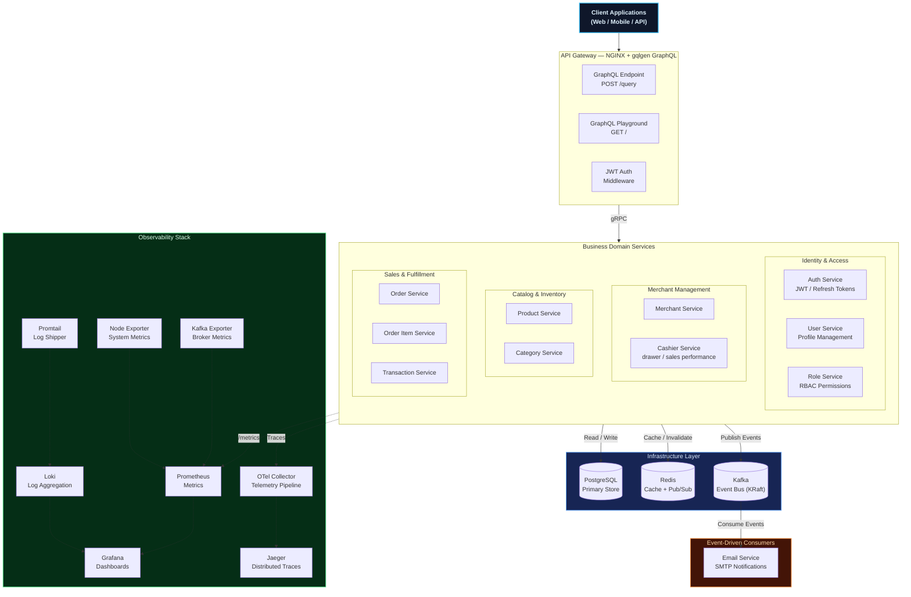
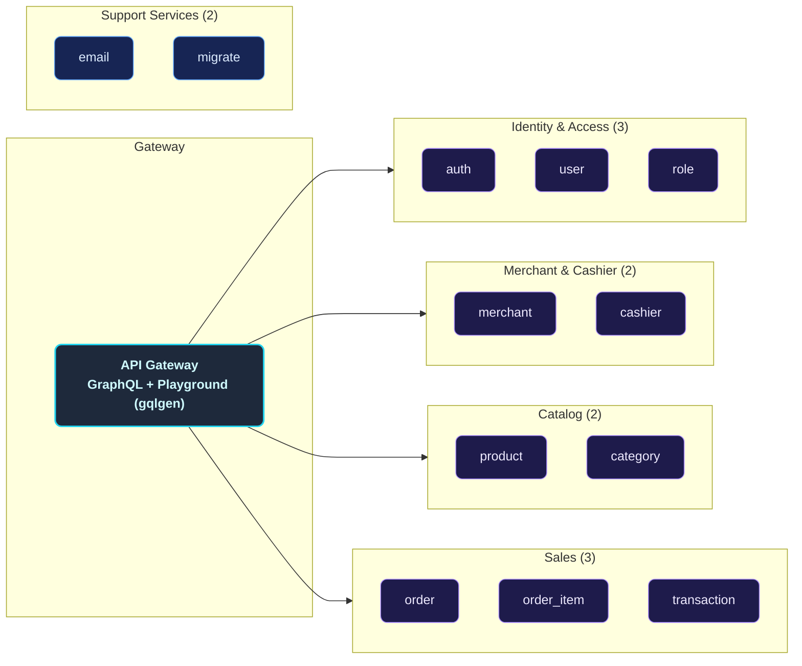
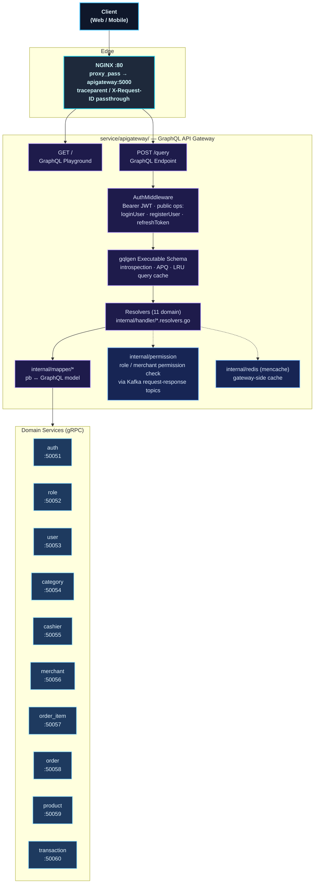
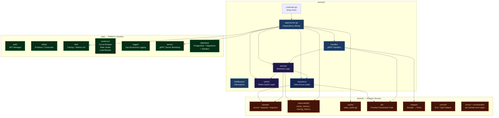
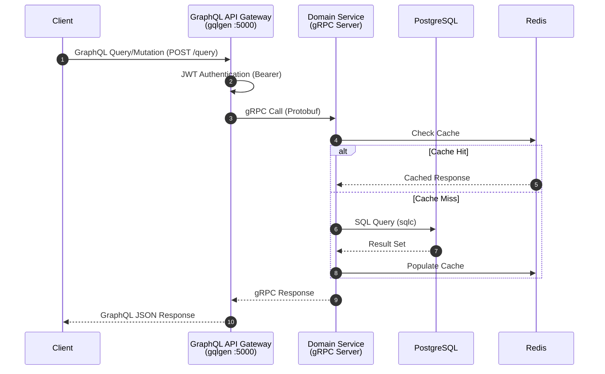
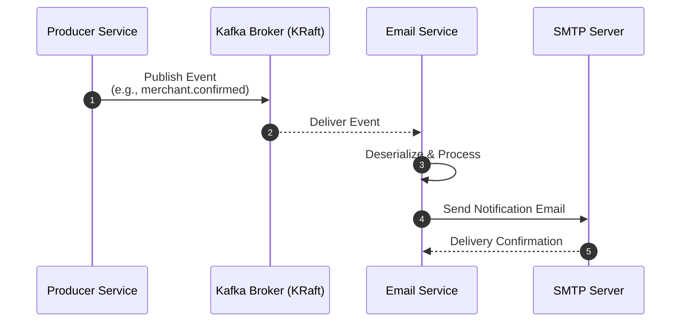
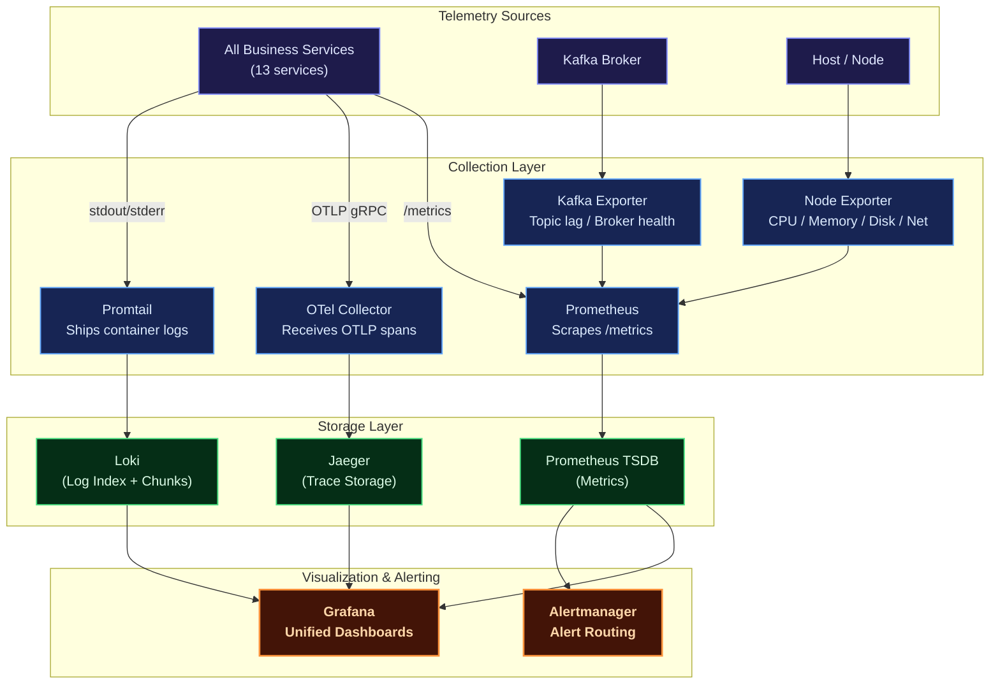
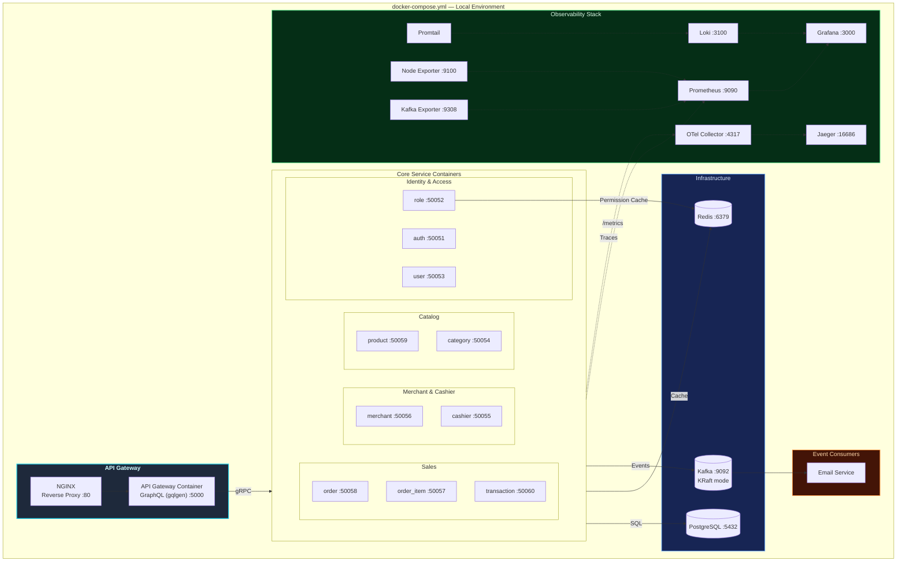
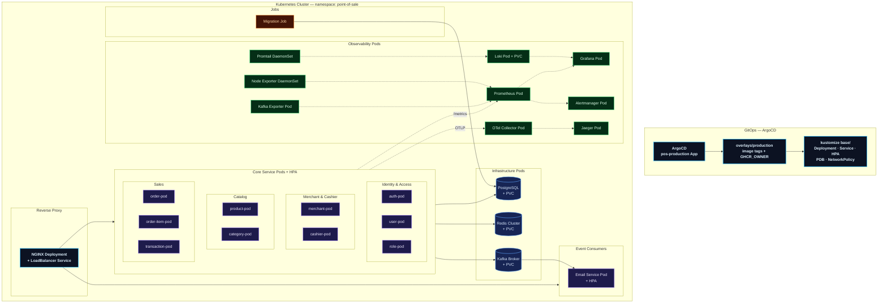

# Distributed Modular Monolith — Point-of-Sale Platform

A production-grade, **modular-monolith point-of-sale backend** built with **Go (Golang)**, designed around domain-driven service boundaries while retaining the operational simplicity of a single deployment unit. Each business domain — Users, Roles, Merchants, Cashiers, Products, Categories, Orders, Order Items, Transactions — lives in its own self-contained module with a clean internal architecture, yet all modules ship as independently deployable containers that communicate via **gRPC** and asynchronous **Kafka** events.

The platform ships with a **full observability stack** (Prometheus, Grafana, Loki, Jaeger, OpenTelemetry), **Redis caching** with instrumented metrics, **circuit-breaker & rate-limiting** resilience patterns, and **Kubernetes** manifests managed via **Kustomize** (base/overlays) with **ArgoCD** GitOps delivery, featuring Horizontal Pod Autoscalers (HPA), Pod Disruption Budgets (PDB), and NetworkPolicies per service.

---

## Key Features

| Domain | Capabilities |
|--------|-------------|
| **GraphQL API** | Schema-first gateway (gqlgen) — Playground, introspection, JWT Bearer auth, automatic persisted queries, LRU query caching, multipart file upload |
| **Auth & Users** | Registration, login, JWT access/refresh tokens, role-based authorization (RBAC) |
| **Merchants** | Merchant onboarding, merchant credentials/document verification |
| **Cashiers** | Cashier profile management, cashier status, active/trashed cashiers, monthly/yearly sales performance stats |
| **Products & Inventory** | Full CRUD for products & categories, stock tracking, pricing, rich descriptions |
| **Orders & Sales** | Checkout, order lifecycle management, order-item decomposition |
| **Transactions** | Payment recording, status tracking, event-driven confirmation pipelines |
| **Notifications** | Kafka-driven email service for merchant/cashier confirmations, transaction updates |
| **Observability** | Metrics (Prometheus + Grafana), Logging (Loki + Promtail), Tracing (Jaeger + OpenTelemetry), System metrics (Node Exporter), Kafka metrics (Kafka Exporter) |
| **Deployment** | Docker Compose for local dev, Kubernetes (Kustomize base/overlays) + ArgoCD GitOps for production |

---

## Architecture Overview

The platform follows a **Distributed Modular Monolith** architecture — each module is a self-contained Go binary with its own clean-architecture internals, deployed as an independent container. An **API Gateway** (NGINX + gqlgen GraphQL) provides a unified **GraphQL API** entry point — the single client-facing surface — translating GraphQL queries and mutations into gRPC calls to downstream services.

### Core Architecture Principles

- **Single Responsibility**: Each service owns its domain logic, data access, and caching layer
- **Clean Architecture**: Every service follows `handler → service → repository` with clear dependency injection; the gateway follows `resolver → mapper → gRPC client`
- **Event-Driven Decoupling**: Kafka enables asynchronous communication without direct service dependencies
- **Observability-First**: Every service is instrumented with OpenTelemetry traces, Prometheus metrics, and structured logging
- **Resilience Patterns**: Built-in circuit breakers, request rate limiters, and load monitors in the shared `pkg/resilience` package



---

## Service Catalog

The platform is composed of **13 independently deployable services** plus supporting infrastructure:



---

## GraphQL API Gateway

The gateway (`service/apigateway/`) is a **schema-first GraphQL server** built with [gqlgen](https://gqlgen.com/). It holds no database of its own — every resolver translates the GraphQL operation into **gRPC calls** to the domain services. The REST layer of previous versions has been fully replaced: there are no REST routes, no Swagger annotations, and no `echo-swagger` — GraphQL introspection + Playground serve as the API documentation.

### Endpoints

| Endpoint | Description |
|----------|-------------|
| `GET /` | GraphQL Playground (interactive schema explorer) |
| `POST /query` | GraphQL API endpoint (also supports `GET` and `multipart/form-data` for file uploads) |

Both are proxied by NGINX (`:80`) and served directly by the gateway (`:5000`, configurable via `CLIENT_PORT`).

### Authentication

`/query` is wrapped by a JWT `AuthMiddleware` (`internal/middlewares/auth.go`):

- Every request must carry `Authorization: Bearer <access_token>`
- **Public operations** skip the token check: `loginUser`, `registerUser`, and `refreshToken`
- The token is validated with the shared `pkg/auth` JWT manager; claims flow into the resolver context for downstream gRPC calls

### Gateway Internals



Beyond the gRPC clients, the gateway also holds:

- **Redis (`internal/redis` / mencache)** — gateway-side caching of hot reads (roles, merchants) with a dedicated Redis instance (`redis_apigateway`) in Docker Compose
- **Kafka producer** — permission checks for role/merchant-scoped operations use Kafka request/response topics (`internal/permission`)
- **gqlgen extensions** — introspection enabled, Automatic Persisted Queries (APQ), and an LRU parsed-query cache (1000 entries)

### Schema & Code Generation

GraphQL schemas live in `graphql/*.graphqls` (one file per domain + `common.graphqls` for shared scalars/pagination types). gqlgen generates everything else:

| gqlgen output | Path |
|---------------|------|
| Executable schema | `internal/handler/generated.go` |
| Generated models | `internal/model/models_gen.go` |
| Resolver stubs (follow-schema) | `internal/handler/{name}.resolvers.go` |

After editing a schema, regenerate with:

```sh
cd service/apigateway
go run github.com/99designs/gqlgen generate
```

If the underlying protobuf contracts changed, run `just generate-proto` first — the mappers depend on the generated code in `shared/pb/`.

### Example Operations

Login (public — no token required):

```graphql
mutation Login {
  loginUser(input: { email: "admin@example.com", password: "secret" }) {
    status
    message
    data {
      access_token
      refresh_token
    }
  }
}
```

Paginated product list (requires Bearer token):

```graphql
query Products {
  findAllProduct(input: { page: 1, pageSize: 10, search: "coffee" }) {
    status
    message
    data {
      id
      name
      price
      countInStock
    }
    pagination {
      current_page
      page_size
      total_pages
      total_records
    }
  }
}
```

Via HTTP:

```sh
curl -s http://localhost:5000/query \
  -H 'Content-Type: application/json' \
  -H "Authorization: Bearer <access_token>" \
  -d '{"query": "query { findAllProduct(input: { page: 1, pageSize: 10 }) { status data { id name } pagination { current_page } } }"}'
```

---

## Internal Service Architecture

Every business service follows a **Clean Architecture** pattern with strict layering. Dependencies flow inward, keeping the core business logic free from infrastructure concerns.



---

## Data & Event Flow

### Synchronous Flow (GraphQL → gRPC)

All client-facing requests flow through the GraphQL gateway, which forwards them over gRPC to the appropriate domain service.



### Asynchronous Flow (Kafka Events)

Services publish domain events to Kafka topics. Downstream consumers (e.g., Email Service) react to these events without coupling to the producer.



---

## Kafka & Event-Driven Architecture

Platform menggunakan Apache Kafka sebagai event backbone untuk **notifikasi
email asinkron**. Tiga service mempublikasikan event ke **8 topik**, dan satu
service (email) menjadi satu-satunya consumer.

### Topologi Topik (8 topik, 1 consumer group)

| Topik | Producer | Fungsi |
|:------|:---------|:-------|
| `email-service-topic-auth-register` | auth | Email selamat datang + verifikasi |
| `email-service-topic-auth-forgot-password` | auth | Email reset password |
| `email-service-topic-auth-verify-code-success` | auth | Email verifikasi sukses |
| `email-service-topic-merchant-create` | merchant | Email pembuatan akun merchant |
| `email-service-topic-merchant-update-status` | merchant | Email perubahan status merchant |
| `email-service-topic-merchant-document-create` | merchant | Email dokumen merchant dibuat |
| `email-service-topic-merchant-document-update-status` | merchant | Email status dokumen merchant |
| `email-service-topic-transaction-create` | transaction | Email transaksi baru |

Konvensi penamaan: `email-service-topic-<domain>-<event>`. Semua topik
dibuat otomatis oleh broker (`KAFKA_AUTO_CREATE_TOPICS_ENABLE=true`).

### Producer & Consumer Matrix

| Service | Produce | Consume |
|:--------|:--------|:--------|
| auth | 3 topik | — |
| merchant | 4 topik | — |
| transaction | 1 topik | — |
| email | — | 8 topik |
| lainnya (user, role, cashier, category, product, order, order_item) | — | — |

### Transactional Outbox Pattern

Semua producer email menulis event ke tabel **`outbox_events`** dalam transaksi
DB yang sama dengan data bisnisnya (Phase 6, 2026-08-16). Relay `pkg/outbox`
mengirim ke Kafka secara async dengan **retry 5x + backoff + dead-letter**
(status `dead` untuk event yang gagal total). Retention 7 hari.

```text
DB commit + outbox insert ──(atomic)──► Relay publikasi ──► Kafka send ──► Email consumer
                                        retry 5x + backoff           dedup Redis → email sekali
```

> **Jaminan inti:** insert data bisnis + insert outbox dalam transaksi DB
> yang sama → Kafka down tidak kehilangan event. Event tetap aman di DB
> dan terkirim saat broker kembali.

### Email Deduplication (`EmailDedupGuard`)

Consumer menggunakan **Redis dedup guard** untuk mencegah email ganda:

- **Key:** `email:dedup:<topic>:<partition>:<offset>` (TTL 24 jam)
- **Fail-open:** Redis error → email tetap dikirim (prioritas: ketersediaan > exactly-once)
- Diuji di `EmailDedupGuardTest`

### Graceful Degradation

| Kondisi | Perilaku |
|:--------|:---------|
| Kafka tidak diinisialisasi | Warn + skip event, operasi utama tetap sukses |
| Email tujuan tidak ditemukan | Warn + skip event |
| `sendMessage` gagal | Error di-log, caller `.recover` → operasi tetap sukses |
| SMTP down | Log error; offset tetap maju (email hilang permanen) |

### Operational CLI

```sh
docker compose -f deployments/local/docker-compose.yml exec kafka bash

# List topik
/opt/kafka/bin/kafka-topics.sh --bootstrap-server localhost:9092 --list

# Cek lag consumer
/opt/kafka/bin/kafka-consumer-groups.sh --bootstrap-server localhost:9092 \
  --group email-service-group --describe
```

### Design Notes

- **Order Service tidak memakai Kafka** — seluruh alur order berjalan
  **sinkron via gRPC** ke Product Service dan Order Item Service.
- **`acks=1`** — kompromi latency vs durability; event bisa hilang jika
  leader crash sebelum replikasi (covered by outbox).
- **Kafka exporter** memantau lag consumer + broker health via Prometheus.
- **Chaos engineering** (`ChaosKafkaInterceptor`) tersedia di modul `common`
  tapi belum di-wire ke producer; siap digunakan saat diperlukan.

---

## Observability Architecture

The platform implements all **Three Pillars of Observability** — Metrics, Logs, and Traces — with a unified visualization layer.



| Pillar | Tool | Purpose |
|--------|------|---------|
| **Metrics** | Prometheus + Grafana | Request rates, error rates, latency percentiles, cache hit ratios, system resource utilization |
| **Logging** | Loki + Promtail | Structured JSON logs from all services, queryable via LogQL in Grafana |
| **Tracing** | Jaeger + OpenTelemetry | End-to-end distributed trace visualization, latency breakdown per service hop |
| **Alerting** | Alertmanager | Alert routing and notification for metric threshold breaches |

---

## Deployment Architectures

### Docker Compose (Local Development)

The Docker Compose setup provides a complete local development environment with all services, databases, message brokers, and observability tools orchestrated in a single command.



### Kubernetes (Production)

The Kubernetes deployment is organized as a **Kustomize** project — a shared
`deployments/kubernetes/base/` (per-service `kustomization.yaml` with
Deployment, Service, HPA, PDB, and NetworkPolicy) plus a production overlay
(`deployments/kubernetes/overlays/production/`) that pins image tags, applies
migration hooks, and resolves the `GHCR_OWNER` image placeholder. Delivery is
GitOps-driven via **ArgoCD** (`deployments/gitops/argocd/`): a single
app-of-apps `pos-production` Application points at the overlay and
self-heals/prunes on every push to `main`. Every service runs in namespace
`point-of-sale` with initContainers that wait for Kafka and fix log volume
permissions before the main container starts.



---

## Technology Stack

| Category | Technology | Purpose |
|----------|-----------|---------|
| **Language** | Go (Golang) | High-performance, statically typed backend |
| **API Gateway** | gqlgen (99designs) | Schema-first GraphQL gateway on `net/http` — resolvers over gRPC clients |
| **RPC** | gRPC + Protobuf | High-performance inter-service communication |
| **Database** | PostgreSQL | Primary relational data store |
| **SQL Codegen** | sqlc | Type-safe SQL → Go code generation |
| **Migrations** | Goose | Database schema migration management |
| **Caching** | Redis | In-memory cache with instrumented metrics (per-service + gateway mencache) |
| **Messaging** | Apache Kafka (KRaft) | Asynchronous event-driven communication (no Zookeeper) |
| **Auth** | JWT | Stateless authentication & authorization |
| **Logging** | Zap | High-performance structured logging |
| **Metrics** | Prometheus | Metric collection & alerting rules |
| **Tracing** | Jaeger + OpenTelemetry | Distributed tracing & telemetry pipeline |
| **Log Aggregation** | Loki + Promtail | Centralized log storage & shipping |
| **Dashboards** | Grafana | Unified metric, log, and trace visualization |
| **Alerting** | Alertmanager | Alert routing & notification dispatch |
| **System Metrics** | Node Exporter | Host-level CPU / Memory / Disk / Network metrics |
| **Kafka Metrics** | Kafka Exporter | Broker health, topic lag, consumer group metrics |
| **Telemetry Pipeline** | OTel Collector | Vendor-agnostic telemetry receive, process, export |
| **Reverse Proxy** | NGINX | GraphQL routing, load balancing, TLS termination, tracing header passthrough |
| **Containerization** | Docker + Docker Compose | Container image building & local orchestration |
| **Orchestration** | Kubernetes | Production-grade container orchestration with HPA |
| **Manifest Management** | Kustomize | Base/overlay composition of K8s manifests (per-service PDB + NetworkPolicy) |
| **GitOps Delivery** | ArgoCD | Declarative app-of-apps sync, self-heal, and prune on push to `main` |
| **API Docs** | GraphQL Introspection + Playground | Self-documenting schema & interactive query explorer |
| **Resilience** | Circuit Breaker, Rate Limiter, Load Monitor | Built-in fault tolerance patterns (`pkg/resilience`) |

---

## Getting Started

### Prerequisites

Ensure the following tools are installed on your system:

- [Git](https://git-scm.com/)
- [Go](https://go.dev/) (v1.25+)
- [Docker](https://www.docker.com/) & [Docker Compose](https://docs.docker.com/compose/)
- [Just](https://github.com/casey/just) (task runner)
- [Protobuf Compiler](https://grpc.io/docs/protoc-installation/) (for proto generation)

For `just generate-proto` you also need the Go protoc plugins on `PATH`
(well-known types like `google/protobuf/empty.proto` are already vendored
under `pkg/proto/google/protobuf/`, so no system include dir is required):

```sh
go install google.golang.org/protobuf/cmd/protoc-gen-go@latest
go install google.golang.org/grpc/cmd/protoc-gen-go-grpc@latest
# ensure $(go env GOPATH)/bin is on PATH, e.g.:
# export PATH="$(go env GOPATH)/bin:$PATH"
```

### 1. Clone the Repository

```sh
git clone https://github.com/MamangRust/monolith-pointofsale-grpc.git
cd monolith-pointofsale-grpc
```

### 2. Configure Environment

The environment files are already tracked in the repository — edit them directly to match your local setup:

```sh
# Root-level configuration (already present in repo)
# .env

# Docker-specific overrides
# deployments/local/docker.env
# docker.env (root-level copy used by CI / docker builds)
```

Edit the `.env` and `docker.env` files to match your local setup (database credentials, Kafka brokers, Redis addresses, etc.).

### 3. Build & Launch (Docker Compose)

```sh
# Build all service images and start the full stack
just build-up

# Run database migrations
just migrate

# (Optional) Seed the database with sample data
just seeder
```

The platform is now fully operational. Verify with:

```sh
just ps
```

### 4. Access Services

| Service | URL |
|---------|-----|
| GraphQL Playground (via Nginx) | `http://localhost:80/` |
| GraphQL Playground (Direct) | `http://localhost:5000/` |
| GraphQL Endpoint | `http://localhost:5000/query` (proxied at `http://localhost:80/query`) |
| Grafana Dashboards | `http://localhost:3000` |
| Prometheus | `http://localhost:9090` |
| Jaeger UI | `http://localhost:16686` |
| Loki (via Grafana) | `http://localhost:3000` → Explore → Loki |

> **GraphQL auth**: semua operasi di `/query` memerlukan header
> `Authorization: Bearer <access_token>`, kecuali operasi publik
> (`loginUser`, `registerUser`, `refreshToken`). Skema lengkap bisa
> dieksplorasi langsung dari Playground lewat introspection — tidak ada
> dokumen API terpisah yang perlu di-generate.

### Stopping the Platform

```sh
just down
```

---

## Justfile Commands

The project uses a single `justfile` as its task runner:

| Command | Description |
|---------|-------------|
| `just build-up` | Build all Docker images and start the entire stack |
| `just up` | Start all services (images must already be built) |
| `just down` | Stop and remove all running containers |
| `just ps` | Show status of all running containers |
| `just migrate` | Run database schema migrations (up) |
| `just migrate-down` | Rollback database migrations |
| `just seeder` | Seed the database with sample data |
| `just build` | Build all services to `bin/` |
| `just generate-proto` | Regenerate Go code from `.proto` definitions (`pkg/proto/` → `shared/pb/`) |
| `just generate-sql` | Regenerate Go code from SQL queries (sqlc) |
| `just build-image` | Build Docker images for all services (context = repo root) |
| `just image-load` | Load Docker images into Minikube |
| `just tidy-all` | Run `go mod tidy` in every service module |
| `just infra-up` | Start infra services only (PostgreSQL, Redis, Kafka, observability) via `docker-compose.infra.yml` |
| `just infra-down` | Stop infra services |
| `just services-up` | Build all local binaries, then run them as background processes (no Docker/Kafka) |
| `just services-down` | Stop all background service processes |
| `just test-unit` | Run mock-based unit tests in `tests/` (`-short`) |
| `just test-pkg` | Run unit tests in `pkg/` |
| `just test-integration` | Run testcontainers integration tests (needs Docker) |
| `just test-all` | Run unit + pkg + integration tests sequentially |
| `just e2e-hurl` | Run Hurl-based E2E tests against the full stack |
| `just smoke-trace` | Verify trace_id continuity across HTTP → gRPC → Kafka → email via Jaeger |
| `just smoke-stack-lifecycle yes` | Destructive stack lifecycle smoke test (requires explicit `yes` argument) |

> **Catatan**: regenerasi kode GraphQL gateway tidak lewat justfile — jalankan
> `go run github.com/99designs/gqlgen generate` dari `service/apigateway`
> setelah mengubah `graphql/*.graphqls`.

---

## Project Structure

```
monolith-pointofsale-grpc/
├── pkg/proto/                      # Protobuf definitions (12 domain .proto + vendored WKT)
├── shared/                         # Shared Go module
│   ├── pb/                         #   Generated protobuf Go code
│   ├── domain/                     #   Domain models (record/request/response)
│   ├── mapper/                     #   Domain ↔ Protobuf mappers
│   ├── cache/                      #   Redis cache abstraction
│   ├── observability/              #   Cache metrics + tracing metrics
│   ├── convert/                    #   Env / type conversion helpers
│   ├── errors/                     #   Per-domain error types (auth_errors, role_errors, ...)
│   └── errorhandler/               #   Error handling utilities
├── pkg/                            # Platform-level Go module
│   ├── auth/                       #   JWT token manager
│   ├── database/                   #   PostgreSQL connection + migrations + seeders
│   ├── kafka/                      #   Kafka producer/consumer wrapper
│   ├── outbox/                     #   Transactional outbox relay
│   ├── otel/                       #   OpenTelemetry initialization
│   ├── resilience/                 #   Circuit breaker, rate limiter, load monitor
│   ├── logger/                     #   Zap structured logger (otelzap bridge)
│   ├── server/                     #   gRPC server bootstrap
│   ├── middleware/                 #   Shared middleware
│   ├── email/                      #   Email client
│   ├── emailretry/                 #   Email send retry logic
│   ├── event/                      #   Event definitions/registry
│   ├── hash/                       #   Password hashing
│   ├── dotenv/                     #   Environment loader
│   ├── redis/                      #   Redis client helpers
│   ├── upload_image/               #   Image upload handler
│   ├── randomstring/               #   Random string generator
│   ├── trace_unic/                 #   Trace ID utilities
│   └── utils/                      #   General utilities
├── service/                        # All microservices
│   ├── apigateway/                 #   GraphQL API Gateway (gqlgen)
│   │   ├── graphql/                #     SDL schemas (12 .graphqls — one per domain + common)
│   │   ├── gqlgen.yml              #     Codegen configuration
│   │   ├── cmd/ + internal/app/    #     Bootstrap & dependency wiring (gRPC clients, Redis, Kafka)
│   │   ├── internal/handler/       #     Generated exec + per-domain resolvers
│   │   ├── internal/model/         #     Generated GraphQL models
│   │   ├── internal/mapper/        #     pb ↔ GraphQL model mappers
│   │   ├── internal/middlewares/   #     Bearer JWT auth (public-op whitelist)
│   │   ├── internal/permission/    #     Role/merchant permission checks via Kafka
│   │   ├── internal/redis/         #     Gateway-side mencache
│   │   └── internal/errors/        #     GraphQL error types per domain
│   ├── auth/                       #   Authentication service
│   ├── cashier/                    #   Cashier service
│   ├── category/                   #   Category management
│   ├── email/                      #   Email notification consumer
│   ├── merchant/                   #   Merchant core
│   ├── migrate/                    #   Database migration runner
│   ├── order/                      #   Order management
│   ├── order_item/                 #   Order item decomposition
│   ├── product/                    #   Product management
│   ├── role/                       #   RBAC role management
│   ├── seeder/                     #   Database seeder (dev/CI tooling)
│   ├── transaction/                #   Payment/transaction processing
│   └── user/                       #   User management
├── deployments/
│   ├── local/                      #   Docker Compose (full + infra-only)
│   ├── kubernetes/                 #   Kustomize base/ (per-service) + overlays/production
│   └── gitops/argocd/              #   ArgoCD app-of-apps config
├── observability/                  #   Prometheus rules, Loki, OTel, Promtail configs
├── grafana/                        #   Grafana dashboard provisioning
├── nginx/                          #   NGINX reverse proxy configuration
├── redis/                          #   Redis configuration
├── tests/                          #   Unit + integration test module (testcontainers)
└── images/                         #   Documentation screenshots
```

---

## License

This project is open-sourced for educational and development purposes.

---

<p align="center">
  Built with Go, gRPC, GraphQL, and a passion for clean architecture.
</p>
